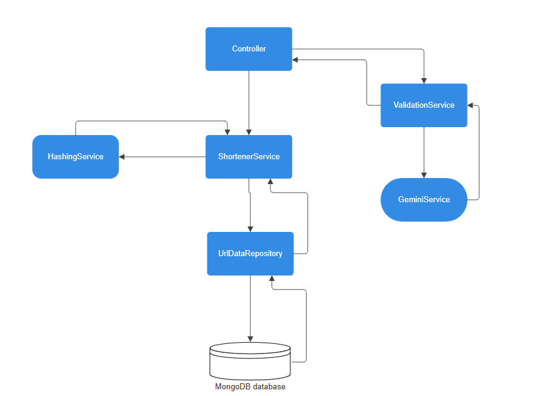

# URL-Shortener


## Objective

This project serves to function as a URL Shortener service similar to TinyUrl. Its a POC service created for self learning/growth and to implement production level features and concerns for any application. 

This project demonstrates how to design and implement testable REST API for shortening URLs, with production-ready features like:
- **Swagger UI** for interactive API documentation
- **Logging** with Logback to a file (`main.log`)
- **Custom exception handling**
- **Unit tests** to promote Test Driven Development, catch defects/bugs early on, and improve code quality
- A skeleton **Validation Service** for extensible input checks. Can be upgraded based on architecture requirements
- **Rate Limiting** using a token-bucket algorithm
- **AI Integration** using **Gemini** to check for malicious urls during creation

---

## Tools Used

| Tool                             | Purpose                        |
| -------------------------------- | ------------------------------ |
| **Java 21**                      | Programming language           |
| **Spring Boot 3.4.7**            | Main framework                 |
| **Maven**                        | Build tool                     |
| **MongoDB & Hibernate**          | NoSQL database                 |
| **JUnit & Mockito**              | Unit testing                   |
| **Logback**                      | Logging framework              |
| **Swagger (springdoc-openapi)**  | API documentation              |
| **Gemini 2.5 Open Source Model** | AI Integration                 |
| **bucket4j**                     | Rate Limiting/Abuse prevention |


---

## Prerequisites

- **Java 21** installed  
- **Maven 3.8+** installed  
- **MongoDB** installed and running locally (default port `27017`)  
- API Key for Gemini must be set as environment variable if you choose to use Gemini
- A stable internet connection to resolve Maven dependencies

---

## How to Run

1. **Clone the Repository**
   ```bash
   git clone https://github.com/dasmatiRice/url-shortener
   cd url-shortener
   
2. **Build the Project**
   ```bash
   mvn clean install

3. **Run the Project**
   ```bash
   mvn spring-boot:run

---

# Design Considerations

A URL Shortening Service may seem simple, but it actually involves many parts and requirements. This section will go over all the design considerations I've made and the tools I have used.

**Functional Requirements**
- Short URL generation - Clients can pass a URL and have a shortened version given back
- Redirection - redirects them to the original URL link they shortened
- Deletion - delete our url from the database
- Custom Alias - clients can pass a custom alias to save their url as
- Custom Expiry Date - Clients will be able to choose the expiration date of their URL

**Non Functional Requirements**
- Availability: The system should be highly available, any downtime will cause link redirection to fail
- Scalability: The system should be horizontally scalable as our demand might increase.
- Readability: The short links generated by our system should ideally be easily readable and typeable.
- Secure/unpredictable links: The short links our service creates should be highly unpredictable to prevent malicious entities from guessing our url hashing.


Our system will expose 3 REST APIS for clients to hit to create, redirect, and delete URLs.

they will follow a design similir to the methods below:

createUrl(api_dev_key, original_url, custom_alias, expiry_date)
redirect(api_dev_key, short_url)
delete(api_dev_key, short_url)

| Field            | Description                                                                                                         |
| ---------------- | ------------------------------------------------------------------------------------------------------------------- |
| **api_dev_key**  | Each user should have a registered ID, this lets us implement security features to our API calls and track activity |
| **original_url** | The original URL the client wants shortened                                                                         |
| **short_url**    | The short URL our service gave back                                                                                 |
| **custom_alias** | OPTIONAL field to have a custom short URL                                                                           |
| **expiry_date**  | OPTIONAL field to have a custom expiry date                                                                         |

The default expiration time is 2 years for today's date

## Database
Our Assumption is that we will have millions of users utilizing our service, as a result we will be storing lots of data and need a horizontally scalably DB. I chose MongoDB
because its is a great horizontally scaling NOSQL database. MongoDB also ensure atomicity at the Document level.

**Replication strategy**
 The Url Shortener Service is going to have a large volume of READ requests 

 MongoDb's replication strategy  follows a primary-secondary node strategy which is perfect for our service. The primary Node handles all write operations (and can assist with read operations) and the secondary nodes will poll the primary node at set intervals to update their information. This lets us use our secondary nodes to assist with Read operations, helping distribute the workload. We can add a load balancer in between to determine which node is free to send client requests to using a Round Robin strategy or doing help checks to ping available servers.


# Code Walkthrough

I've created a flowchart to show how the code flows through the system



- The Controller is the main entry into the system. For info regarding the APIs check out the Api Documentation section
- The Shortening Service implements the main business logic
- The Gemini Service, hosts our AI call to Gemini to check is a URL is malicious or not. For more info check out the AI integration section

### Api Documentation

the Api endpoints can be seen via swagger by following this link:
http://localhost:8080/swagger-ui/index.html#/ 


| Method | Endpoint      | Description                        |
| ------ | ------------- | ---------------------------------- |
| `POST` | `createUrl`   | Create a new short URL             |
| `GET`  | `/{shortUrl}` | Redirect to the original long URL  |
| `GET`  | `/deleteUrl`  | Delete a Short URL                 |
| `GET`  | `/health`     | Checks id server is up and running |
| `GET`  | `/GetAll`     | Gets all items in DB               |

### Short URL Generation

To generate our short URLS I have created a HashingService class. That class takes the original URL and hashes it with base58 hashing. I have chosen to remove the 
following characters because it can be confusing for end users to read and type those characters as some look similar.
**Removed:**
- O (capital o)
- 0 (zero)
- I (capital I)
- l (lower case L)
- `+ (plus)
- / (slash)

### Rate Limiting
I implemented Rate limiting using a token-bucket algorithm using bucket4j for the service. Rate limiting is important to prevent people with malicious intents to abuse our system. Its to prevent people to continiously spamming calls to the servers and causing our systems to fail for everyone. 

I've configured the bucket to hold a maximum of 50 tokens and every minute it refreshes up to 50 tokens. This number can be easily scaled up or down based on the volume of requests we get and our system requirements. 

### AI Integration

The GeminiService class was added to showcase some basic AI integration into the project. It was easy integrate and has added a lot of benefits to project. I used Gemini specifically to check for malicious original URLs during the encoding process. It was to make sure those new links cant be used to scam or trick other people.   
Going forward in the future we can ask Gemini to analyze our data and run more complicated scenarios which we can provide to our users.

While AI integration is not necessary for our service, it demonstrates how AI can be included in our system. With its integration we now have the capabilities of utilizing AI for all of its many benefits in our system, while being mindful of its drawbacks. In our case the drawbacks are that the calls to Gemini are very bandwidth intensive and to call it every time we check for a malicious url during creation will tie up our resources. It may be better to make one large call and when our service has low usage

If you choose not to use Gemini, you an comment out the code block, follow the directions in the comments of the validation class.

To use Gemini in the project you much have an API key configured, you can follow the links below to generate your own key.
Then you must set your key in the environments variable for Windows machines. The links below will help you configure your environment

links for Gemini integration:
https://ai.google.dev/gemini-api/docs/api-key


### Unit Testing
The core business logic has been unit tested using Mockito and Junit

### Logging
Logging is configured using Logback.
All application logs are written to main.log in the project root directory.
Logs include info, warnings, and error traces for easier debugging and tracing.

---
# Future Improvements


---

# Contact
For more information please reach out to me via Linkedin: https://www.linkedin.com/in/ansuman-das-6796b7137/


